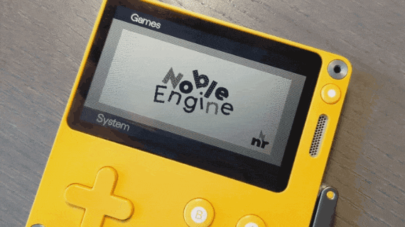

Noble Engine
============
### A li'l game engine for Playdate.

The Playdate SDK is probably the most user-friendly console SDK ever made, but if you're familiar with state/scene-based game engine frameworks like Unity, Flixel, Citrus, or others, you may be looking for a library that can get your game "on its feet,” extend existing APIs, offer new features, or provide more intuative ways to leverage the SDK in your game.

If so, you're looking for Noble Engine!

Features
--------
-   Complete scene lifecycle management. Handle update loops, sprites, input, and initialization steps on a per scene basis.
-   Scene transition API and animation library with over a dozen transition types (cross dissolve, dip-to-black, and more).
-   Settings/SaveGame API, supporting up to 1000 save slots and automatic updating of on disk files when you inevitably muck around with your data structure in development.
-   Boilerplate menu object, with simple way to add/remove items and manage “click” handlers.
-   Additional input methods, and per-scene \`inputHandler\` logic.
-   Full state manager for sprite animations.
-   New fonts! Including full Japanese katakana character set.
-   Fully documented code, explaining methods and architecture, and LDoc-generated [documentation pages](https://noblerobot.github.io/NobleEngine).
-   Full project template, with example scenes and launcher assets, to help beginners get started with Playdate development.
-   Random goodies, like a unified text drawing method for normal/aligned/localized text, one-line methods for showing/hiding the crank indicator and the FPS counter, and more.

Setup
-----

### Via Template
The recommended setup procedure is to clone the [Noble Engine Project Template repository](https://github.com/NobleRobot/NobleEngine-ProjectTemplate) instead of this one. That project is available as a [GitHub Template](https://github.blog/2019-06-06-generate-new-repositories-with-repository-templates/), which you can use to start your own project if you're hosting it on GitHub, or you can clone or download it manually.

The template repository includes this one as a [git submodule](https://www.atlassian.com/git/tutorials/git-submodule). This way, you can mange your use of Noble Engine independently from your own code.

The project template also includes some usage examples to help you get up to speed on how Noble Engine works.

### Manual setup
If, instead, you want to download or clone this repository directly in to a new or existing project, simply place it into `libraries/noble/` relative to your `main.lua` file.

Once you’ve done that, using Noble Engine can be quickly wired up in your `main.lua` file:

~~~~~~~~~~~~~~~~~~~~~~~~~~~~~~~~~~~~~~~~~~~~~~~~~~~~~~~~~~~~~~~~~~~~~~~~~~~~~~~~
import libraries/noble/Noble
import scenes/MyStartingScene -- Or whatever your game's first scene is.

Noble.new(MyStartingScene)
~~~~~~~~~~~~~~~~~~~~~~~~~~~~~~~~~~~~~~~~~~~~~~~~~~~~~~~~~~~~~~~~~~~~~~~~~~~~~~~~

**Note:** If you are adding Noble Engine to an existing project, it is still recommended to either start with the project template and bring your existing code in, or reorganize your project to mimic the structure of the template. The project template defines a folder layout and has some additional flotsam that reflects the “opinion” of Noble Engine, which is useful if you want to have the best experience using it.

Documentation
-------------
Noble Engine is fully documented in code, and has a full set of html pages generated with [LDoc](https://github.com/lunarmodules/LDoc) and styled for legibility, ease-of-use, and playful charm if I do say so myself.

These pages are included in the repository at `docs/index.html` and on [GitHub Pages](https://noblerobot.github.io/NobleEngine).

Notes on Style
--------------
Noble Engine was originally developed for _Widget Satchel II: Return of Sprocket_, by Mark LaCroix, who never wrote a line of Lua in his life before starting this project.

In general, Lua best-practices are followed, but in some cases code style and naming conventions are more likely to follow those found in “C-like” languages such as Haxe, C\#, Java, ActionScript, etc.

-   Methods and variables are **camelCase**.
-   “Class” names are **TitleCase**, and Lua “modules” are treated as nested classes, thus `Noble.Text` instead of `noble.text`.
-   Constants, such as `Noble.TransitionType.DIP_TO_BLACK`, are **ALL_CAPS_SNAKE_CASE**
-   Argument names are prefixed with a **double-underscore**, as in `__displayName`. This mostly impacts documentation legibility. I’m very sorry but it couldn’t be helped. 😆
-   Names are verbose by default; no abbreviations. This includes aliases for Playdate packages, so `playdate.graphics` is aliased as `Graphics`, instead of `gfx`.

Some of these conventions run counter to those seen in the Playdate SDK. In places where there’s a potential conflict, either an alias is created for Noble Engine’s version to match the engine’s code style, or the Playdate SDK item is given preference and Noble Engine stays out of its way.
